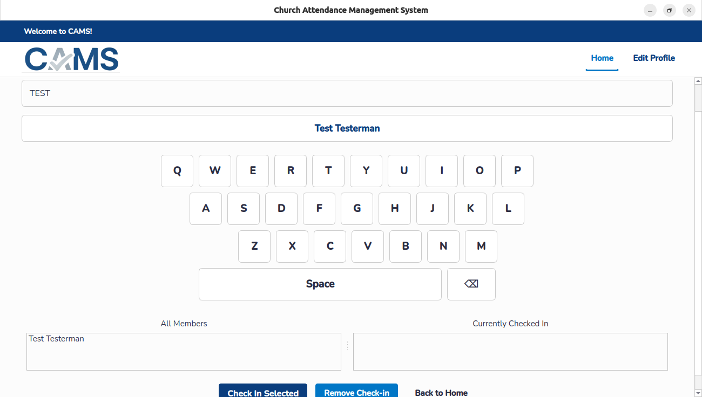
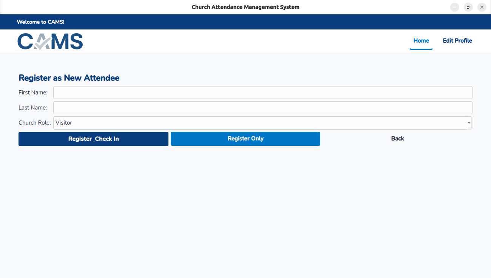
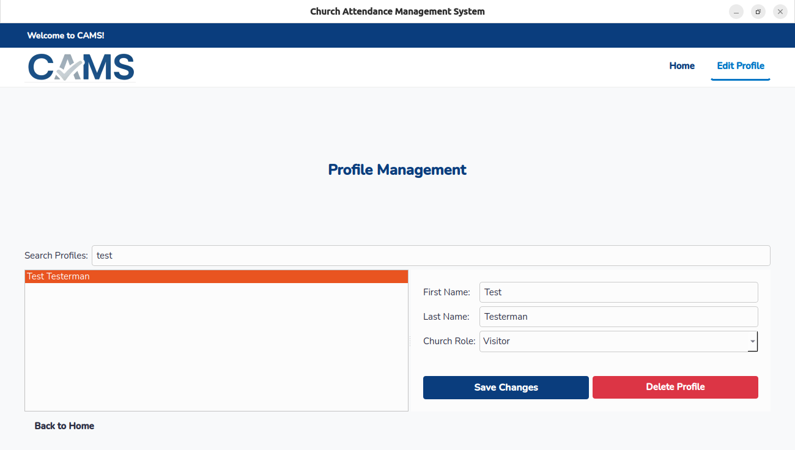
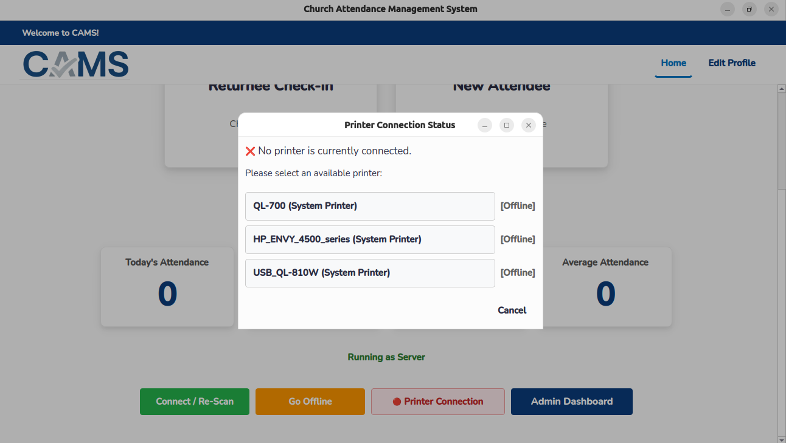
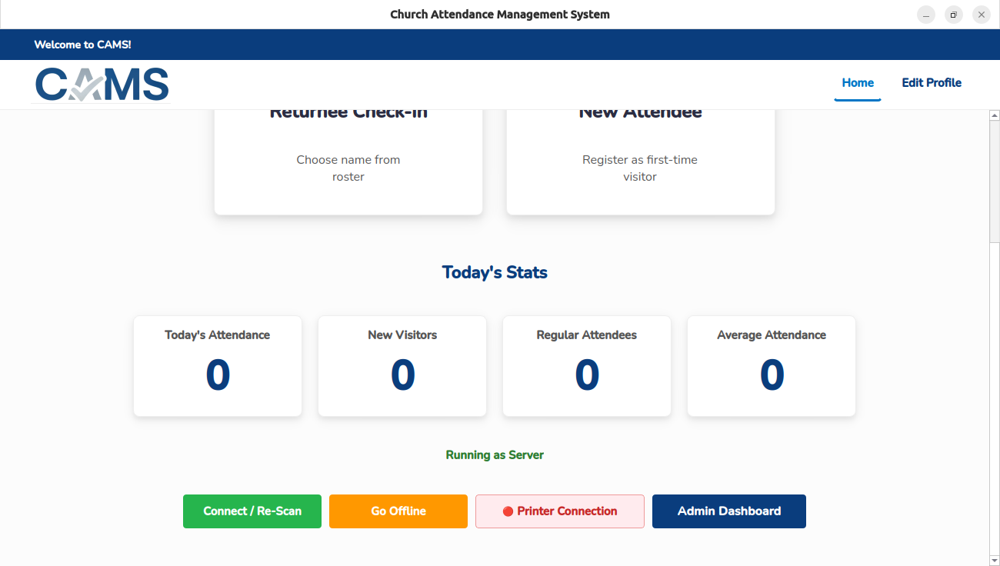
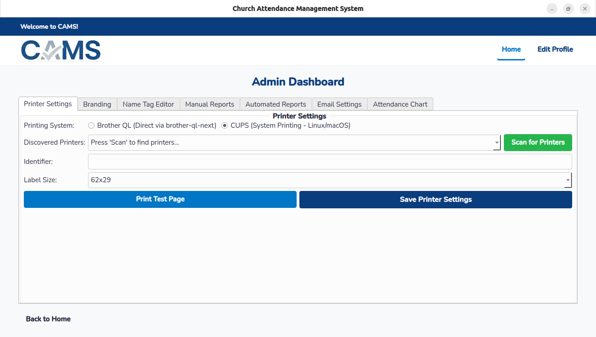

<div align="center">
  

  # CAMS: Church Attendance Management System

  A user-friendly, free, and open-source tool to simplify attendance management, event check-ins, and name tag printing for organizations like churches.

  <!-- Badges -->
  <p>
    
    
    
    
  </p>
</div>


---

## 📖 Table of Contents

- [About The Project](#-about-the-project)
- [✨ Key Features](#-key-features)
- [🚀 Getting Started](#-getting-started)
  - [Platform Support](#platform-support)
  - [Prerequisites](#prerequisites)
  - [Installation (Linux)](#installation-linux)
- [💻 Usage](#-usage)
  - [Recommended: Desktop Shortcuts](#recommended-desktop-shortcuts)
  - [Alternative: From the Terminal](#alternative-from-the-terminal)
- [📚 User Guide](#-user-guide)
- [🤝 Contributing](#-contributing)
- [📜 License](#-license)

---

## 🏛️ About The Project

CAMS was created to provide a simple, no-cost solution for churches and other small organizations to track attendance for their services and events. It focuses on the core needs of tracking who attended and when, while also printing name tags to help foster a welcoming, close-knit community environment.

---

## ✨ Key Features

- **✅ Simple Attendance Tracking**: Easily record attendance for any event and view stats over time.
- **📇 Instant Name Tag Printing**: Automatically print name tags for attendees, guests, and children upon check-in.
- **🔄 Network Syncing**: Run CAMS on multiple computers on the same network and see all check-ins sync in real-time.
- **⚙️ Guided Setup**: An installer script checks for dependencies and sets up the program's environment for you.
- **🎨 Customizable**: Easily configure the program with your own organization's logo and welcome message.
- **🐧 Cross-Platform**: Primarily built for Linux, but also runs on Windows with support for Brother QL-series label printers.

---

## 🚀 Getting Started

This guide will walk you through setting up and running CAMS on your local machine.

### Platform Support

This project is developed primarily for Debian-based Linux distributions but can be run on Windows with a notable printing limitation.

| Operating System   | Support Level | Printing Note                                                   |
| ------------------ | ------------- | --------------------------------------------------------------- |
| **Ubuntu / Debian**| ✅ Full       | Fully supported. Uses the system's CUPS printing service.       |
| **Windows**        | ⚠️ Partial    | The application runs, but printing is only supported for Brother QL-series label printers. |

### Prerequisites

- **Linux (Ubuntu/Debian):**
  - Python 3.8 or newer.
  - The `python3-venv` and `python3-pip` packages. Install them with:
    ```bash
    sudo apt update && sudo apt install python3-venv python3-pip
    ```

- **Windows:**
  - [Python 3](https://www.python.org/downloads/) installed from python.org.
  - > **IMPORTANT:** During installation, ensure you check the box that says **"Add Python to PATH"**.

### Installation (Linux)

The installation process is handled by a guided script.

1.  **Clone the Repository**
    Open your terminal and clone this project to your machine.
    ```bash
    git clone https://github.com/joemoco7/CAMS.git
    ```
    (Or, you can download the ZIP and extract it).

2.  **Navigate to the Directory**
    ```bash
    cd CAMS
    ```

3.  **Run the Installer Script**
    This script will check for system libraries, create a Python virtual environment (`venv`), and install all required packages.
    ```bash
    python3 CAMS_Installer.py
    ```
    > **Note:** If any system dependencies are missing, the script will notify you and provide the `sudo apt install ...` command to run.
    >
    > **Warning:** Do not run this installer script with `sudo`.

Once the script finishes, your environment is ready!

---

## 💻 Usage

After a successful installation, you can run the application using the provided shortcut files. This is the recommended method for daily use.

### Recommended: Desktop Shortcuts

#### For Linux Users (`.desktop` file)

The `Start CAMS.desktop` file is a standard Linux shortcut. You must edit this file with the correct paths before it will work.

1.  **Open the Shortcut File:** Navigate to the CAMS folder and open `Start CAMS.desktop` in a text editor.

2.  **Update the Paths:** You must replace the example paths with the **full, absolute path** to the CAMS folder on your computer.

    -   Find the line `Path=`.
        -   *Before:* `Path=/home/acer/Church_Attendance_Management_System/`
        -   *After (Example):* `Path=/home/your_username/Documents/CAMS/`

    -   Find the line `Icon=`.
        -   *Before:* `Icon=/home/acer/.local/share/applications/CAMS-icon.png`
        -   *After (Example):* `Icon=/home/your_username/Documents/CAMS/Assets/Images/CAMS-Logo.png`

3.  **Install the Shortcut:** Save the file. Now, copy it to your local applications directory using the terminal:
    ```bash
    # Run this command from inside the CAMS project folder
    cp "Start CAMS.desktop" ~/.local/share/applications/
    ```
    After this, "CAMS" should appear in your application launcher (you may need to log out and back in).

#### For Windows Users (`.bat` file)

The `Start CAMS.bat` file is designed to work without any modification.
1.  Navigate to the CAMS folder in File Explorer.
2.  Double-click the `Start CAMS.bat` file.

A command prompt window will appear, and the application will launch. This window helps you see error messages if the program closes unexpectedly.

### Alternative: From the Terminal

This method is useful for debugging or if you prefer the command line.

1.  Open a terminal (Linux) or Command Prompt/PowerShell (Windows).
2.  Navigate to the CAMS project directory:
    ```bash
    cd /path/to/your/CAMS/folder
    ```
3.  Run the launcher script directly:
    - **On Linux:**
      ```bash
      python3 CAMS_Launch.py
      ```
    - **On Windows:**
      ```bash
      python CAMS_Launch.py
      ```

---

## 📚 User Guide

Click the dropdown below for a complete guide on all of CAMS's features.

<details>
<summary><strong>Expand Full User Guide...</strong></summary>

### Quick Start Guide

1.  **Launch the Application:** Start CAMS on one or more computers.
2.  **Network Connection:** Ensure all computers are on the same local network (e.g., same Wi-Fi). The first instance becomes the "Server," and others will connect to it automatically.
3.  **Connect a Printer:**
    - On the main screen, click the **🔴 Printer Connection** button.
    - Select an "Available" printer from the list.
    - The button will turn green (**🟢 Printer Connection**) when connected.
4.  **Add Your Branding (Optional):**
    - Go to **Admin Dashboard** → **Branding** tab.
    - Update the `Welcome Banner Text` and provide a path to your church's logo.
    - Click **Save Branding Settings**.
5.  **Start Checking People In!**
    - **Returnee Check-in:** For anyone who has attended before.
    - **New Attendee:** To register first-time visitors.

---

### In-Depth Feature Guide

#### Main Screen Functions
The main screen is your central hub for daily operations.

-   **Returnee Check-In**

    This screen is for logging attendance for anyone previously registered.
    -   **How to use:** Start typing a name in the search bar. The list will filter, and the top results will appear as large Quick Select buttons. Click a name and confirm to check them in. An attendance record is created, and a name tag is printed.
    -   **Signed-In List:** The list on the right shows everyone currently checked in.
    -   **Removing a Check-in:** Select a name from the "Currently Checked In" list and click **Remove Check-in**.

-   **New Attendee**

    Register first-time visitors or new members.
    -   **How to use:** Enter the person's first and last name and assign a role (e.g., "Visitor").
    -   **Register & Check In:** Saves their profile, logs attendance for today, and prints a name tag.
    -   **Register Only:** Saves their profile for the future without checking them in.

-   **Edit Profile**

    Modify information for any existing profile via the top navigation bar.

-   **Printer Connection**

    This button on the home screen shows connection status (🔴/🟢) and is a shortcut to the printer selection dialog.

-   **Connect / Re-Scan**

    Forces CAMS to re-scan the network for other instances, which is useful if a connection was lost or another computer joins late.

-   **Go Offline**
    Disconnects the CAMS instance from the network sync to run in a standalone mode.

#### Admin Dashboard
The control center for all CAMS settings and reports.



-   **Printer Settings Tab:** Configure your label printer, scan for devices, and print test pages.
-   **Branding Tab:** Customize the welcome banner text and application logo.
-   **Name Tag Editor Tab:** Customize the layout of printed name tags with a live preview.
-   **Manual Reports Tab:** Generate and export attendance reports as Excel files for a specific date range.
-   **Automated Reports Tab:** Schedule reports to be automatically generated and emailed daily, weekly, etc.
-   **Email Settings Tab:** Configure an email account for sending reports.
    > **Note:** For services like Gmail, you must use an **"App Password"** generated from your Google Account security settings, not your regular password.
-   **Attendance Chart Tab:** Displays a graph of attendance over the last four Sundays for a quick visual overview.

</details>

---

## 🤝 Contributing

Contributions are what make the open-source community such an amazing place to learn, inspire, and create. Any contributions you make are **greatly appreciated**.

If you have a suggestion that would make this better, please fork the repo and create a pull request. You can also simply open an issue with the tag "enhancement".

1.  Fork the Project
2.  Create your Feature Branch (`git checkout -b feature/AmazingFeature`)
3.  Commit your Changes (`git commit -m 'Add some AmazingFeature'`)
4.  Push to the Branch (`git push origin feature/AmazingFeature`)
5.  Open a Pull Request

---

## 📜 License

Distributed under the MIT License. See `LICENSE` for more information.
