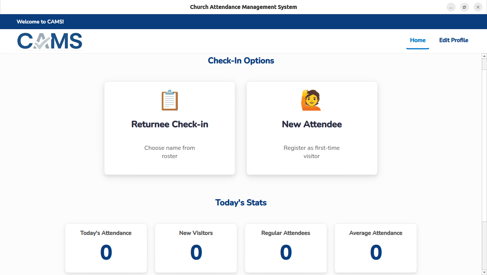

# CAMS
**Church Attendance Management System**

A user-friendly, free, and open-source tool to simplify attendance management and event check-ins for organizations like churches.

**About The Project**

CAMS was created to provide a simple, no-cost solution for churches and other small organizations to track attendance for their services and events. CAMS focuses on the core needs of tracking who attended and when, as well as printing name tags to help foster a welcoming environment.
Key Features

- Attendance Tracking: Easily record attendance for different events over time.

- Name Tag Printing: Quickly print name tags for attendees, guests, and children.

- Automated Setup: An installer script to check for dependencies and set up the program's environment.

- Cross-Platform (with caveats): Primarily built for Linux, but can run on Windows for users of Brother QL-series label printers.

- Customizable: Easily configure the program with your own organization's logo.

**Getting Started**

This guide will walk you through setting up and running CAMS on your local machine.
Platform Support

This project is developed primarily for Debian-based Linux distributions (like Ubuntu), but can be run on Windows with a notable limitation.
Operating System	Support Level	Printing Note
Ubuntu / Debian:	Full	Fully supported. Uses the system's CUPS printing service.
Windows:	Partial	The application runs, but printing is only supported for Brother QL-series label printers due to the brother-ql-next library.
Prerequisites

- Linux (Ubuntu/Debian):
  Python 3 (e.g., python3.8 or newer)
  The python3-venv and python3-pip packages. You can install them with:
            
        sudo apt update && sudo apt install python3-venv python3-pip

- Windows:
  Python 3 installed from python.org. Ensure you check the box "Add Python to PATH" during installation.

**Installation** (Linux)

The installation process is handled by a guided script.

1.) Clone the repository:
Open your terminal and clone this project to your machine.
  
        git clone https://github.com/joemoco7/CAMS.git

  

  - (Or, you can download the ZIP and extract it).

2.) Navigate to the directory:

        cd CAMS

3.) Run the Installer Script:
This script will check for system libraries, create a Python virtual environment (venv), and install all required packages. 

        python3 CAMS_Installer.py
  
  *   If any system dependencies are missing, the script will notify you and provide the `sudo apt install ...` command to run.
  *   **Important:** Do not run this script with `sudo`.

Once the script finishes, your environment is ready.

**Running After Installation**

After a successful installation, you can run the application using the provided shortcut files. This is the recommended method for daily use.
Recommended Launch Method: Desktop Shortcuts

**- For Linux Users (.desktop file) -**

The "Start CABC-T CAMS.desktop" file is a standard Linux shortcut that will add CAMS to your system's application menu. You must edit this file before it will work.
  Open the Shortcut File: Navigate to the CAMS project folder and open Start CABC-T CAMS.desktop in a text editor.

  Update the Path: Find the line that starts with Path=. You must replace the example path (/home/acer/Church_Attendance_Management_System/) with the full, absolute path to the CAMS folder on your computer.

        Before: Path=/home/acer/Church_Attendance_Management_System/

        After (Example): Path=/home/your_username/Documents/CAMS/

  Update the Icon (Optional but Recommended): Find the line that starts with Icon=. You can point this to the logo included in the project or any other icon file you prefer. Again, you must use the full, absolute path.

        Before: Icon=/home/acer/.local/share/applications/CAMS-icon.png

        After (Example): Icon=/home/your_username/Documents/CAMS/assets/images/logo.png

  Install the Shortcut: Save your changes to the file. Now, copy the edited file to your local applications directory using the terminal:

  - You can use this when stating from inside the CAMS project folder
    
        cp "Start CABC-T CAMS.desktop" ~/.local/share/applications/

      

After these steps, "CAMS" should appear in your application launcher (you may need to log out and back in for it to show up).

    - Note for non-GNOME users: This shortcut uses gnome-terminal to launch the script. If you are using a different desktop environment (like KDE Plasma or XFCE), you may need to change gnome-terminal -- bash -c '...' to the equivalent for your system's terminal (e.g., konsole -e bash -c '...').

**- For Windows Users (.bat file) -**

The Start CABC-T CAMS.bat file is designed to work without any modification.

  Simply navigate to the CAMS folder in File Explorer.

  Double-click the Start CABC-T CAMS.bat file.

A command prompt window will appear, and the CAMS application will launch. The window will remain open after you close the application; you can press any key to dismiss it. This is intentional, as it allows you to see any error messages if the program closes unexpectedly.

**- Alternative Method: Running from the Terminal -**

This method is useful for debugging or if you prefer using the command line.

  Open a terminal (Linux) or Command Prompt/PowerShell (Windows).

  Navigate to the CAMS project directory.

    
      cd /path/to/your/CAMS/folder

  

Run the launcher script directly:

  On Linux:
  
    python3 CAMS_Launch.py

  On Windows:
  
    python CAMS_Launch.py
